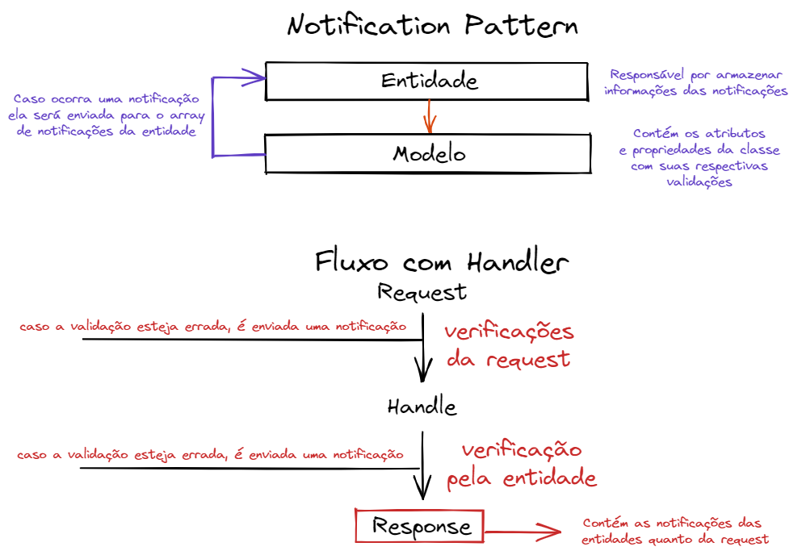

# Notification Pattern

Esse Design Pattern é responsável por criar **avisos de utilização da solução** sem criar grandes alardes como acontecem em exceções, ao contrário do feito em lançamentos de exceções esse Design Pattern **não utiliza tanto recursos de disco e recursos do sistema**, já que apenas registram os eventos de acontecimento. O [Flunt](https://github.com/andrebaltieri/flunt) é um caminho para utilizar esse pattern de modo fácil e rápido.

Veja a esquematização a seguir do funcionamento de uma Notification Pattern com Handlers:

